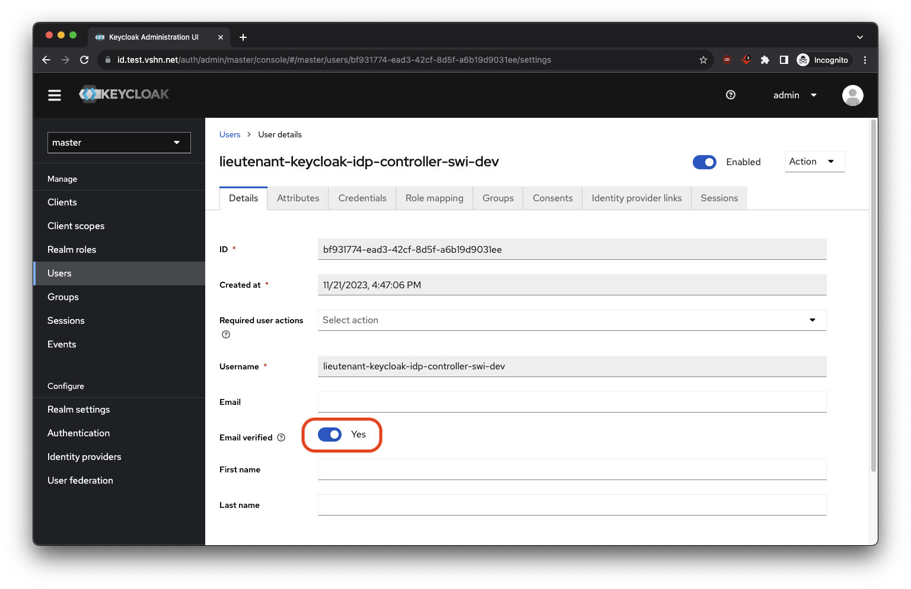
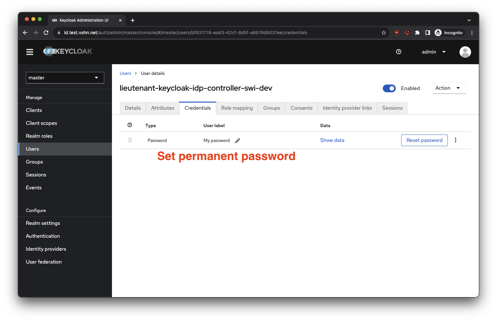
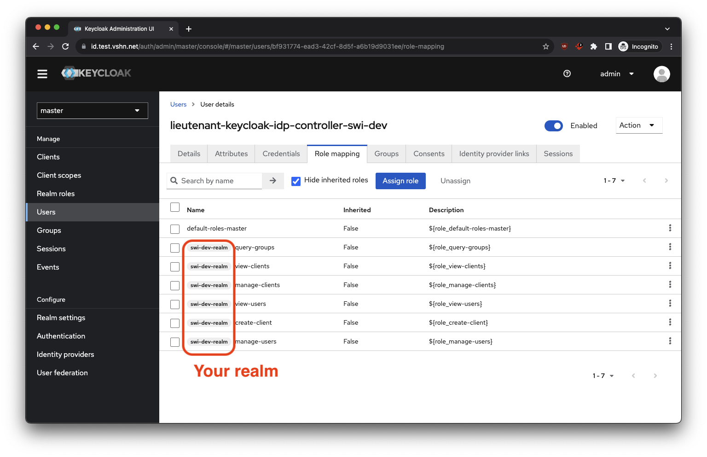

# lieutenant-keycloak-idp-controller

Lieutenant Keycloak IDP Controller is a Kubernetes controller that runs in a Lieutenant cluster and manages the creation of Keycloak OIDC clients for every registered cluster.

## Getting Started
You’ll need a Kubernetes cluster to run against. You can use [KIND](https://sigs.k8s.io/kind) to get a local cluster for testing, or run against a remote cluster.
**Note:** Your controller will automatically use the current context in your kubeconfig file (i.e. whatever cluster `kubectl cluster-info` shows).

### Running on the cluster
1. Install Instances of Custom Resources:

```sh
# install the CRDs into the cluster
kubectl apply -k https://github.com/projectsyn/lieutenant-operator//config/crd

# apply some objects to the cluster to your discretion
kubectl apply -f config/samples/
```

2. Build and push your image to the location specified by `IMG`:

```sh
make docker-build docker-push IMG=<some-registry>/lieutenant-keycloak-idp-controller:tag
```

3. Deploy the controller to the cluster with the image specified by `IMG`:

```sh
make deploy IMG=<some-registry>/lieutenant-keycloak-idp-controller:tag
```

### Uninstall CRDs
To delete the CRDs from the cluster:

```sh
make uninstall
```

### Undeploy controller
UnDeploy the controller from the cluster:

```sh
make undeploy
```

### How it works
This project aims to follow the Kubernetes [Operator pattern](https://kubernetes.io/docs/concepts/extend-kubernetes/operator/).

It uses [Controllers](https://kubernetes.io/docs/concepts/architecture/controller/),
which provide a reconcile function responsible for synchronizing resources until the desired state is reached on the cluster.

### Test It Out
1. Install the CRDs into the cluster:

```sh
make install
```

2. Run your controller (this will run in the foreground, so switch to a new terminal if you want to leave it running):

```sh
make run
```

**NOTE:** You can also run this in one step by running: `make install run`

### Modifying the API definitions
If you are editing the API definitions, generate the manifests such as CRs or CRDs using:

```sh
make manifests
```

**NOTE:** Run `make --help` for more information on all potential `make` targets

More information can be found via the [Kubebuilder Documentation](https://book.kubebuilder.io/introduction.html)

## VSHN Development Infrastructure

For a full E2E development setup the VSHN infrastructure has you covered.

1. Create your isolated realm on the testing Keycloak <https://id.test.vshn.net/auth/admin/master/console/#/master/add-realm>.
2. Create a user for the controller in the admin realm <https://id.test.vshn.net/auth/admin/master/console/#/master/users/add-user>.
Configure as follows:



3. [Sign in](https://kb.vshn.ch/corp-tech/projectsyn/how-tos/connect-to-lieutenant-clusters.html) to the `lieutenant-dev` cluster at <https://syn-lieutenant-dev.apps.cloudscale-lpg-2.appuio.cloud/>.
4. Run the controller with the following command:
```sh
REALM=your-realm-name
KEYCLOAK_USER=your-controller-user
KEYCLOAK_PASSWORD=your-controller-password

make RUN_ARGS="--keycloak-realm=$REALM --keycloak-base-url=https://id.test.vshn.net --keycloak-user=$KEYCLOAK_USER --keycloak-password=$KEYCLOAK_PASSWORD --keycloak-login-realm=master --keycloak-legacy-wildfly-support=true --vault-address=https://vault-dev.syn.vshn.net/ --vault-token=$(kubectl create token -n lieutenant lieutenant-keycloak-idp-controller)" run
```
